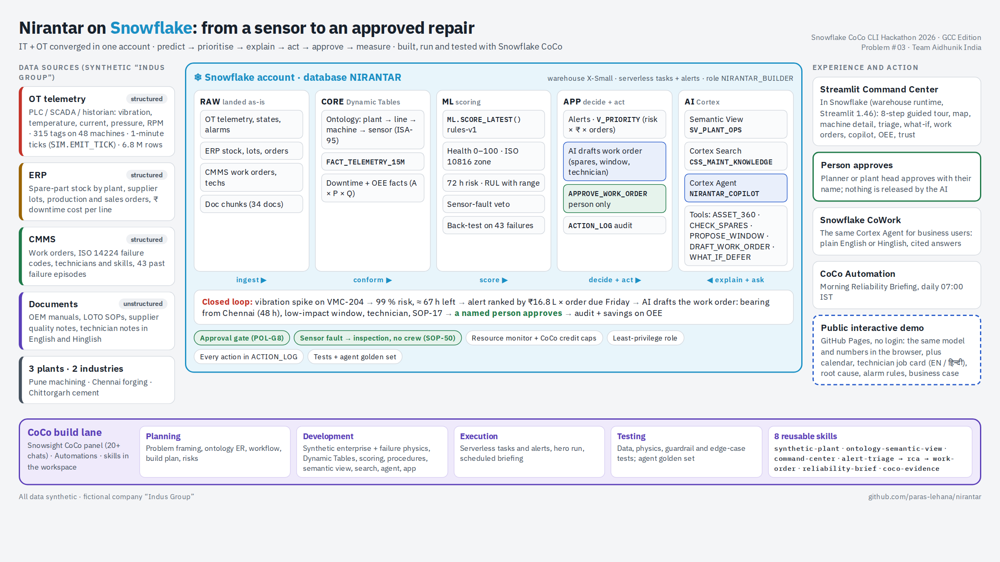

# Nirantar (निरंतर): AI Reliability Command Center on Snowflake, built with CoCo

**From a vibration spike to an approved, parts-ready work order in under 2 minutes.** IT + OT converged on Snowflake;
built, run and tested with **Snowflake CoCo** (Cortex Code) in Snowsight.

*Snowflake CoCo CLI Hackathon 2026, GCC Edition · Problem #03 Predictive Maintenance and OEE Command Center · Team
**Aidhunik India**: Paras Lehana (team leader) and Abhinav Kaushik*. All data is **synthetic** (fictional "Indus Group").

> ### 🧑‍⚖️ For evaluators: try it in 5 minutes
> | What | Link |
> |---|---|
> | ▶️ Demo video (3 min) | `<YouTube unlisted URL>` |
> | 🕹️ **Interactive demo (no login, runs in your browser on sample data)** | **https://paras-lehana.github.io/nirantar/app/** : the whole loop with 5 scenarios, live simulation clock, approvals, copilot, back-test |
> | ✅ For judges: every brief point and CoCo guideline, one click each | https://paras-lehana.github.io/nirantar/app/#/judges |
> | 🌐 Story page (guided snapshot of the live app) | https://paras-lehana.github.io/nirantar/ |
> | 🎞️ Submission deck (43 slides, hackathon template, one screen per slide) | [web version](https://paras-lehana.github.io/nirantar/docs/slides-submission/nirantar-submission-deck.html) · [PDF](docs/slides-submission/nirantar-submission-deck.pdf) |
> | 🎞️ Story deck (19 slides) | [web version](https://paras-lehana.github.io/nirantar/docs/slides/nirantar-deck.html) · [PDF](docs/slides/nirantar-deck.pdf) |
> | 🗺️ Explorable architecture diagram (archify) | https://paras-lehana.github.io/nirantar/docs/diagrams/archify/architecture-nirantar-20261006-2030/nirantar-architecture.html |
> | 🔐 Live Streamlit app in Snowflake | needs a Snowflake login; screenshots [`08`](docs/screenshots/08-snowflake-streamlit-plant-map.jpg) and [`09`](docs/screenshots/09-snowflake-streamlit-work-orders.jpg) |
> | 🧠 CoCo evidence (journal, screenshots, the prompts CoCo received) | [`docs/coco-journal.md`](docs/coco-journal.md) · [`docs/evidence/`](docs/evidence/) · [`docs/evidence/prompts-used.md`](docs/evidence/prompts-used.md) |
> | 🧩 Reusable CoCo skills (8) | [`skills/`](skills/) · plugin [`./.cortex-plugin/plugin.json`](.cortex-plugin/plugin.json) · `cortex skill add https://github.com/paras-lehana/nirantar` |
> | 📊 Datasets & licences | [`DATASETS.md`](DATASETS.md) |

---

## The problem
Manufacturers lose value to **unplanned downtime** because OT sensor data (PLC/SCADA/historian) sits apart from ERP
(spares, supplier lots, production and sales orders) and maintenance context (CMMS work orders, failure codes, manuals).
Alarms fire, but nobody can answer fast enough: *what will fail, why, what does it cost, and what exactly should we do,
and when?*

## What Nirantar does
| | Capability |
|---|---|
| 🏭 **Digital twin** | Live plant floor map of 3 plants. Assets colored by health, ringed when an alert is open. Asset 360 with sensor trends vs ISO 10816 zones, and an IT + OT timeline (sensors, ERP order and stock, maintenance history on one axis) |
| 🔮 **Predict** | Health index, RUL with confidence band, 72-hour failure risk, failure-mode signature. Sensor faults are told apart from machine faults. Backtested lead time |
| 🚨 **Triage** | Alerts ranked by risk × ₹ downtime × repair time × criticality × customer-order pressure. Noise (sensor faults, planned changeovers) suppressed |
| 🛠 **Act** | The agent drafts a **parts-ready, production-aware work order**: spares checked across plants (reserve / transfer / PR), window chosen from the production schedule before predicted failure, qualified technician, cost and OEE impact. **A human approves**, and everything is audited |
| 💬 **Ask** | NL + Hinglish copilot (Cortex Agent: Analyst on a governed semantic view + Search over manuals/notes + action tools). Evidence-based RCA with citations, e.g. *"why does VMC-204 keep failing?"* (sensor evidence + SOP + spares) and fleet questions such as *"which supplier lot is linked to spindle-bearing failures?"* (L-2391, from quality notes) |
| 📈 **Lift OEE** | A × P × Q by plant/line/shift, Six Big Losses, what-if (fix now vs at changeover vs defer) |
| 🛡 **Trust** | Approval gate, sensor-fault veto, idempotency, rate limits, confidence floor, CoCo credit caps, RBAC, audit log, agent evals |

## Architecture


More diagrams: explorable archify versions of the [architecture](docs/diagrams/archify/architecture-nirantar-20261006-2030/nirantar-architecture.html) and the [closed loop as a sequence](docs/diagrams/archify/sequence-closed-loop-20261006-2040/closed-loop.html) · [the closed loop, who does what](docs/diagrams/02-closed-loop.png) · [the 8 CoCo skills across the lifecycle](docs/diagrams/03-coco-skills.png).

OT tags, ERP, CMMS and documents land in `RAW`. Dynamic Tables build the ontology + facts (`CORE`). A serverless task
graph scores the live stream (`ML`: health, RUL, risk). A serverless alert runs the agent tools that draft work orders
(`APP`). A governed **Semantic View** (`AI.SV_PLANT_OPS`) and **Cortex Search** feed the **Cortex Agent**
`NIRANTAR_COPILOT`. The **Streamlit** command center and **Snowflake CoWork** sit on top.

## Built with CoCo across the lifecycle
| Phase | What CoCo did | Evidence |
|---|---|---|
| Planning | Framed the problem; drafted the ontology (Mermaid ER), the workflow and the build plan; profiled the data | `docs/evidence/P/` |
| Development | Generated the synthetic enterprise and failure physics; built Dynamic Tables, scoring, procedures, semantic view, search, agent and Streamlit app | `docs/evidence/D/` |
| Execution | Created serverless tasks/alerts; ran the hero scenario; scheduled a **CoCo Automation** (Morning Reliability Briefing) | `docs/evidence/E/` |
| Testing | Wrote and ran integrity/physics tests, the agent golden set and edge cases (sensor fault, no spares, approval bypass) | `docs/evidence/T/` |
| Surfaces | **CoCo in Snowsight** (Cloud Agent: panel, parallel chats, workspace files, `.snowflake/cortex/skills`) · CoCo Automations · Cortex Agent registered for Snowflake CoWork · the **CoCo CLI** (v1.1.104) installs the 8 skills from this repository; running them from the CLI needs a Snowflake login | `docs/evidence/`, `docs/evidence/X/` |

## Reusable CoCo skills
`nirantar-synthetic-plant` · `nirantar-ontology-semantic-view` · `nirantar-command-center` · `nirantar-alert-triage` ·
`nirantar-rca` · `nirantar-work-order` · `nirantar-reliability-brief` · `nirantar-coco-evidence`. Install and chaining:
[`skills/README.md`](skills/README.md).

## Results (measured on synthetic data)
| Metric | Value |
|---|---|
| Synthetic estate | 3 plants, 24 monitored assets in the Pune hero plant (48 in total), 315 sensor tags, 6.8 M telemetry rows over 75 days, 43 seeded failure episodes |
| Failures detected early in backtest | **83.7 %** (36 of 43), 5 failure families |
| Median early-warning lead time | **36 h** |
| False alarms / asset / month | **0.28** |
| Hero scenario (VMC-204, spindle bearing) | risk 0.99 · RUL 66.8 h · ISO zone C · failure mode *Bearing wear* · draft WO: SKF-7014 transfer Chennai → Pune, Thursday changeover window, certified technician |
| OEE (last 75 days) | Pune 65.7 % · Chennai 56.1 % · Chittor 73.4 % |
| Agent golden set | Snowflake agent: first run 60 %, re-run after semantic-view fixes (results in `OPS.AGENT_EVAL_RESULTS`). Public demo copilot: 15 of 15 golden questions, 820 phrasings |
| Credits used by the full build | about $250 of the $400 trial by 06 Oct, mostly CoCo chats; the live path costs about $3 a day while running (design estimate) |

## Rebuild in your own account
1. Add the skills (Snowsight: upload to `.snowflake/cortex/skills/`; CLI: `cortex skill add https://github.com/paras-lehana/nirantar`).
2. In CoCo: `/nirantar-synthetic-plant generate the Indus Group sandbox`, then replay the prompts CoCo received, in order:
   [`docs/evidence/prompts/`](docs/evidence/prompts/) (index: [`docs/evidence/prompts-used.md`](docs/evidence/prompts-used.md)).
3. The rules CoCo followed in the workspace: [`snowflake-workspace/AGENTS.md`](snowflake-workspace/AGENTS.md).

## Run the demo locally
```bash
git clone https://github.com/paras-lehana/nirantar && cd nirantar
python3 -m http.server 8090            # then open http://127.0.0.1:8090/app/
node app/tests/store.test.mjs          # model + store: hero numbers, approvals, technician flow
node app/tests/golden.test.mjs         # copilot: 15/15 golden questions, 820 phrasings, guardrail
```

## Repository map
`skills/` + `.cortex-plugin/` CoCo skills · `snowflake-workspace/AGENTS.md` CoCo workspace rules · `docs/evidence/` +
`docs/coco-journal.md` CoCo evidence and the prompts that built each object · `docs/diagrams/`, `docs/screenshots/`,
`docs/slides/` visuals · `docs/research/03-domain-pdm-oee.md` domain sources (ISO 10816, OEE, downtime figures) ·
`app/` interactive demo (vanilla JS, synthetic data, see `app/DEV.md`) · `index.html` story page · `tools/` service-worker
builder and the route sweep.

## Limits & honesty
Synthetic data only. Prototype on a Snowflake trial (no container runtime, so the Streamlit app runs on the warehouse
runtime). Numbers above are measured on synthetic data and are not real-plant claims. Scoring is an explainable rules
model (`rules-v1`), not a trained ML model. The sensor feed is simulated by a 1-minute serverless task. MCP connectors
(Jira, Slack, Drive) are shown as previews in the demo; nothing is sent.

License: MIT · © 2026 Aidhunik India
